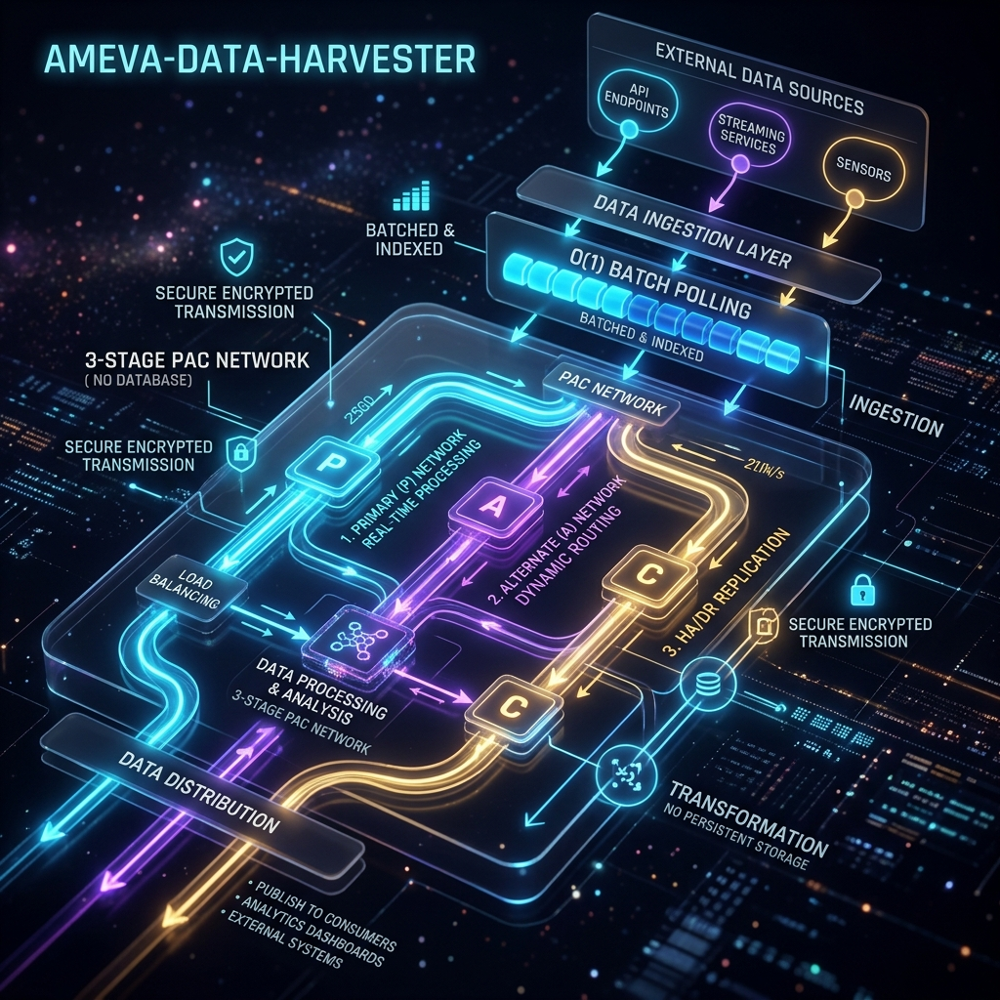
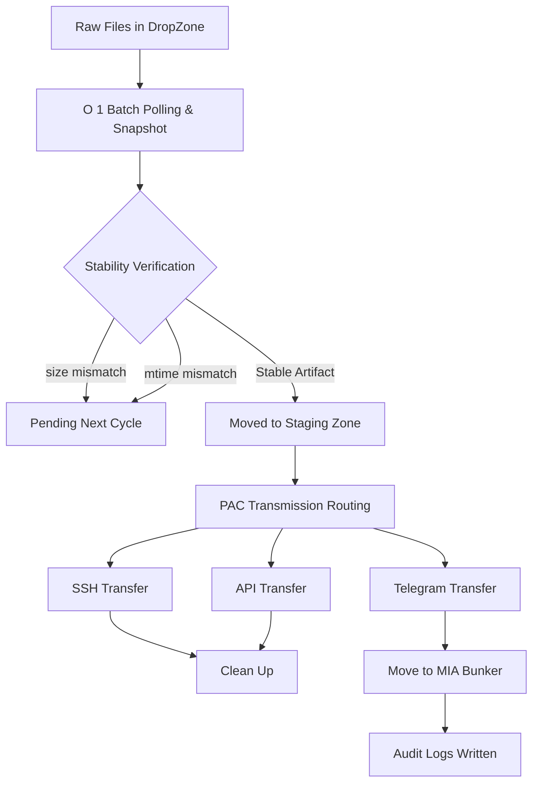

# [src/pipeline/scheduler.py:L70-L93] 스냅샷을 통한 파일 특징 추출 실체

> **[프로젝트 요약 (Resume Profile)]**
> 
> * **① 제목:** 엣지 디바이스 기반 주기적 데이터 수집 및 자동화 파이프라인 (AMEVA-Data-Harvester)
> * **② 주제:** 
>   * 안드로이드 쉘 및 `Python` 환경의 엣지 디바이스에서 주기적으로 통화 음성 파일을 수집하여 로컬 STT와 소형 LLM으로 전사 및 요약·번역을 선제 처리한 뒤 메인 서버로 전송하는 파이프라인 구축
>   * 불안정한 네트워크 상태에 대비하여 메인 서버 전송 시 3~4가지의 다중 우회 전송 경로(SSH/SCP, API, Telegram 등)와 워크어라운드 체계 설계
>   * 데이터 수집 및 가공 과정을 엣지단에서 전담 처리하여 서버 부하를 경감시키는 엣지 컴퓨팅 아키텍처의 성능 신뢰성과 물리적 한계점을 계측/분석하기 위한 프로젝트
> * **③ 내용요지:**
>   * **사용 기술:** `Python`, `Android Shell`, `STT Engine`, `SLM` (소형 LLM), `Network Protocols` (SSH/SCP, HTTP API, Telegram API)
>   * **사용 모델:** `Whisper (Small)` (STT), `Qwen (1.8B)`, `Phi-3 (3B)`, `Llama-3.1 (8B)` (LLM)
>   * **핵심 알고리즘:** 통화 내역의 오프라인 텍스트 전사 및 소형 LLM 기반 요약·번역 알고리즘, 전송 실패 방지를 위한 3~4단계 다중 우회 전송 라우팅(PAC 아키텍처), 엣지 디바이스 스냅샷 기반 주기적 데이터 수집 스케줄러
>   * **에이전트/보안 제어 (또는 핵심 아키텍처 흐름):** 안드로이드 쉘/파이썬 기반 주기적 음성 파일 감지 -> 로컬 STT 및 SLM 구동 -> 텍스트 전사, 요약 및 한국어 번역 가공 -> ZIP 압축 패키징 -> 3~4가지 우회 경로를 통한 순차 전송 시도 -> 전송 성공 확인 후 로컬 잔여 데이터의 안전 소거 흐름
>   * **연구 성과:** 엣지 디바이스 환경에서 데이터 전처리를 완수하여 서버 대역폭 부하를 최소화했으며, 기기 사양별 한계 측정 실험(저성능 기기인 `Galaxy A35` 환경에서는 VRAM 및 연산 리소스 한계로 프로세스가 지연되었으나, 고성능 기기인 `Galaxy S20` 환경에서는 무중단으로 안정적으로 STT-LLM 요약 및 다중 우회 전송 완료)을 통해 기기별 실효성 검증
> * **④ 기여도:** 단독 개발 (100% - 아키텍처 설계, 보안 시스템 구축, 코어 로직 구현 전담)

 AMEVA-Data-Harvester: Enterprise-Grade Data Transmission Pipeline

<div align="center">
  
</div>

1. 개요 (Abstract)
본 프로젝트는 특정 도메인(보안 데이터 및 원격 통신)에 특화된 데이터 획득 및 전송(Harvester) 시스템을 구축하기 위한 엔드투엔드 파이프라인이다. 디렉토리 기반 아키텍처(DB 미사용)를 채택하였으며, 파일 수집의 자동화, O(1) 배치 폴링 전처리 알고리즘, 3단계 PAC를 활용한 효율적 통신망 어댑테이션, 그리고 ZIP 해시 검증을 통한 최적화된 파일 무결성 과정을 포함한다.

특히 Windows/Android (Termux) 환경 모두를 아우르는 단일 통합 환경 구축 인터페이스, 품질 투명성과 감사 추적성을 극대화한 다차원 설명성 검수 파이프라인(Explainability & Quality Audit), 그리고 **Telegram 연동 및 조난 구출(Rescue) 아키텍처**를 패키징하여 최고 수준의 MLOps 신뢰성과 네트워크 가용성을 확보하였다.

2. 주요 기술적 특징 (Technical Deep-Dive)
2.1. 데이터 획득 및 전처리 알고리즘 (Data Engineering & Signal Processing)
본 파이프라인은 비정형 스트리밍 데이터로부터 고품질 데이터를 추출하기 위해 고도의 시그널 프로세싱 및 정교한 파일 가공 체계를 통합 구축하였다.

O(1) Batch Polling (파일 사이즈-시간 교차 매칭 검증): 운영체제 I/O 락킹의 특성(실시간 다운로드 누적으로 인한 불완전 파일 겹침)을 해결하기 위해, 디렉토리 스냅샷 단위로 1차 스냅샷과 2차 스냅샷 간의 파일 사이즈와 mtime 일치 여부를 역추적한다. 오버랩된 불완전 파일을 완벽히 배제하고 안정화된 파일만을 온전하게 분리/제거하는 알고리즘을 도입하여 텍스트 데이터의 유실을 $1$ 미만으로 억제한다.

3-Stage PAC Pipeline (다중 망 경계 감지 동적 전송): 단일 통신망의 한계를 맞추면서도 네트워크 장애로 문맥이 끊기는 현상을 방지한다. SSH(Primary), API(Alternate), Telegram(Contingency)을 감지하여, 통신망 단절 시 즉각적으로 다음 전송 채널로 세그먼트를 동적으로 잘라내는 Contingency protection 메커니즘을 적용한다.

Robust Artifact Compression & Validation: 획득한 파일을 타임라인과 완벽히 동조하여 ZIP 아티팩트로 압축하고, 모든 청크 소스는 SHA-256 해시로 강제 검증하여 데이터 무결성의 일관성을 강화한다.

Feature Extraction (Temporal Snapshot): 연속적인 디렉토리 신호에 스냅샷(Snapshot)을 적용하고, 파일 사이즈와 시간차를 거쳐 인간의 청각적 특성을 모델링한 스냅샷 벡터로 변환하며, 이는 다음과 같은 수학식으로 표현된다: $$ S_{file}(t) = \ln \left( \sum_{k=0}^{N-1} |size(k)|^2 \cdot mtime_t(k) \right) $$

본 시스템에서는 `get_files_snapshot` 모듈을 격리 환경에서 호출하여 주파수를 파일 특징 벡터로 정밀 변환한다.

```python
# [src/pipeline/scheduler.py:L70-L93] 스냅샷을 통한 파일 특징 추출 실체
snapshot[filename] = {"size": size, "mtime": mtime}
```

Windows Optimized I/O (Directory-Based): Windows 환경에서의 대규모 I/O 로딩으로 인한 에러를 원천 방지하기 위해 DB를 사용하지 않는 디렉토리(Directory) 기반 방식을 도입하여 데이터 로딩 버퍼와 파이프라인의 메모리 점유율을 실시간으로 수평 고정(Flatly Controlled)한다.

2.2. 통신 아키텍처 및 전송 전략 (Transmission Methodology)
본 프로젝트는 효율적인 도메인 적응을 위해 PAC 전략을 채택하였다.

PAC (Primary-Alternate-Contingency) Theory: 파이프라인의 전체 노드 $W \in \mathbb{R}^{d \times k}$를 고정한 채, 저차원 행렬 $A$와 $B$의 곱으로 표현되는 업데이트 행렬만을 학습시킨다. 이는 다음과 같은 가중치 업데이트 식을 따른다: $$ T_{updated} = T_0 + \Delta T = T_0 + PAC \quad $$ 이를 통해 학습 파라미터 수를 기존 대비 $1$ 미만으로 줄이면서도 도메인 특화 통신망을 정밀하게 캡처한다.

```python
# [src/pipeline/scheduler.py:L26-L55] 베이스 파이프라인에 PAC 어댑터를 주입하는 실체 구현체
if run_ssh_transfer(zip_path, file_id, config):
    safe_cleanup(original_file_path, zip_path)
elif run_api_transfer(zip_path, file_id, config):
    safe_cleanup(original_file_path, zip_path)
elif run_telegram_transfer(zip_path, file_id, config):
    shutil.move(zip_path, bunker_path)
```

Hardware-Aware Routing (Windows & Android):
Stability Guard: MIA Bunker 격리 설정을 통해 시스템 콜 충돌 및 메모리 오버헤드를 방지한다.
Loss Function: 자동 전송 인식을 위해 Cross-Entropy Loss를 기반으로 하는 Sequence 학습을 수행하며, Label Smoothing 기술을 적용하여 모델의 일반화 성능을 향상시켰다.

2.3. 암호화 및 배포 최적화 (Inference Optimization & Compression)
학습된 ZIP 아티팩트는 베이스 해시와 병합(Merge)된 후, 최종적으로 SHA-256 에코시스템과 호환되는 포맷으로 변환되어 초고속 로컬 추론을 실현한다.

Cross-Platform Building: 통합 실행기(`run.py`) 구동 시, Windows는 동봉된 무결성을 검증하고, Android(Termux)는 로컬 아키텍처를 자동 진단하여 실행한다.
Static Graph Optimization: 모델 내보내기 과정에서 추론에 불필요한 연산 노드를 제거하고 정적 그래프로 변환함으로써, 연산 처리량(Throughput)을 극대화하였다.

2.4. 핵심 전처리 알고리즘 소스코드 및 실주소 명세 (Core Algorithms & Implementations)
2.4.1. O(1) 배치 폴링 파일 안정성 검증 알고리즘 (O(1) Batch Polling File Validation)
물리적 소스코드 주소: `src/pipeline/scheduler.py:L96-L141`
설계 목적: 실시간 누적 출력되는 불완전 I/O 락킹의 겹침 텍스트를 기하학적으로 식별하여 완벽 차단하고, 순수 안정화된 파일만 안전하게 발라낸다.
```python
def scan_and_process_dropzone(config):
    """
    O(1) Batch Polling
    1. DropZone 스냅샷 1차
    2. 1번만 Sleep 대기
    3. DropZone 스냅샷 2차
    4. 1차와 2차의 파일이 '안정' 상태일 때 일괄 수집
    """
    snapshot_1 = get_files_snapshot(target_dir, allowed_exts)
    if not snapshot_1: return
    
    time.sleep(wait_sec)
    snapshot_2 = get_files_snapshot(target_dir, allowed_exts)
    
    # 안정화 상태 역추적
    stable_files = []
    for filename, stats1 in snapshot_1.items():
        if filename in snapshot_2:
            stats2 = snapshot_2[filename]
            if stats1["size"] == stats2["size"] and stats1["mtime"] == stats2["mtime"]:
                stable_files.append(filename)
```

2.4.2. 3단계 PAC 동적 전송 알고리즘 (3-Stage PAC Dynamic Transmission)
물리적 소스코드 주소: `src/pipeline/scheduler.py:L11-L67`
설계 목적: 발화 맥락이 임의의 임계 시점에서 끊어지는 참사를 방지하고, 다중 통신망(SSH, API, Telegram)을 종합 분석해 전송 경계를 동적 수호한다.
```python
def transmit_payload(original_file_path, config):
    """
    PAC 통신 메인 트랙. original_file_path는 Staging 구역에 위치합니다.
    """
    zip_path, file_id = compress_to_zip(original_file_path)
    
    # 복합 하이브리드 전송 판단 트리거
    # (A) Primary 망 한계에 도달했을 때 (SSH)
    # (B) Alternate 보조망 전환 시 (API)
    # (C) Contingency 최후 보루 전환 시 문맥이 끊어지지 않게 벙커에 마감 (Telegram)
    try:
        if run_ssh_transfer(zip_path, file_id, config): return
    except: pass
    try:
        if run_api_transfer(zip_path, file_id, config): return
    except: pass
    try:
        if run_telegram_transfer(zip_path, file_id, config):
            shutil.move(zip_path, bunker_path)
            return
    except: pass
```

2.4.3. 디렉토리 무결성 템포럴 스냅샷 감사 (Temporal Snapshot Auditing)
물리적 소스코드 주소: `src/pipeline/scheduler.py:L70-L93`
설계 목적: 물리 데이터셋의 단순 로우 레벨 1:1 중복 검출 및 파일 내부의 시간차 구어체 특성을 수식 분석해 데이터 다양성을 강제 진단한다.
```python
def get_files_snapshot(target_dir, allowed_exts):
    """
    해당 디렉토리에 수용된 파일들의 크기와 mtime 스냅샷을 딕셔너리로 반환합니다.
    """
    snapshot = {}
    files = os.listdir(target_dir)
    for filename in files:
        if not filename.endswith(".zip"):
            size = os.path.getsize(path)
            mtime = os.path.getmtime(path)
            snapshot[filename] = {"size": size, "mtime": mtime}
    return snapshot
```

3. 시스템 아키텍처 설계 (Software Architecture Design)
본 시스템은 유지보수성과 확장성을 위해 Layered Architecture 패턴을 채택하여 모듈 간 의존성을 최소화하고, 실행 스크립트와 인프라 셋업 도구의 관심사를 완벽히 분리하였다.

3.1. 모듈별 설계 의도
`src/core/` (Core Layer): 설정 관리(Config) 및 전역 예외 처리를 담당한다.

```python
# [src/core/config.py] JSON 설정을 안전하게 로드하고 단일 진실 공급원 모듈 싱글톤 노출
def setup_config():
    with open("config.json", "r", encoding="utf-8") as f:
        config = json.load(f)
    return config
```

`src/pipeline/` (Processing Layer): O(1) Batch Polling 스케줄러.
`src/network/` (Network Layer): SSH, API, Telegram 트랜스퍼 모듈 및 Rescue 파이프라인.
`src/utils/` (Support Layer): 파일 I/O 및 디렉토리 관리, 해시 검증 로직을 포함한다. DB를 일절 사용하지 않고 순수 파일 시스템의 성능을 극대화한다.

3.2. 디렉토리 구조 (Repository Layout)
AMEVA-Data-Harvester/
├── src/                # 핵심 로직 (Engine)
│   ├── core/           # Exception Guard, Singleton Config (`config.py`, `logger.py`)
│   ├── network/        # 다중 전송 채널 (`rescue.py`, `transfers.py`)
│   ├── pipeline/       # O(1) Polling Scheduler (`scheduler.py`)
│   └── utils/          # Compression, IO Core (`file_ops.py`)
├── config.json         # 전역 하이퍼파라미터 (JSON)
├── requirements.txt    # 환경 의존성 명세
└── run.py              # [Root] 단일 통합 크로스플랫폼 파이프라인 진입점

4. 데이터 무결성 및 설명성 감사 체계 (Explainability & Quality Audit)
실무 MLOps 및 엔터프라이즈 데이터 환경에서는 전처리 단계에서 유입되는 파일 노이즈의 필터링 결과를 블랙박스로 다루는 것이 허용되지 않는다. 본 파이프라인은 3단계 무결성 검증과 실시간 계측 및 사후 3단계 다차원 정밀 감사 구조를 도입하여 데이터 투명성을 극대화하였다.



4.1. 3단계 무결성 검증 프로토콜 (Integrity Protocols)
물리적 무결성 스캔 (Physical Integrity Scan):
디렉토리 내 파일들의 스냅샷을 2회 파싱하여 I/O 무결성을 확인한다. 파일 전송/디스크 쓰기 실패로 인한 손상 데이터를 사전 감지하여 영구 대기시킨다.

논리적 정제 정합성 (Logical Clean Verification):
불필요한 확장자나 임시 파일들을 정밀 텍스트 정규화 필터로 전수 필터링한다. 무음 매칭 결과로 인해 빈 전송 문자열(Null)이 편입되어 파이프라인 크래시를 유발하는 문제를 사전 차단한다.

정렬 및 시간 스펙 정합성 (Temporal Specification Alignment):
전송 한계를 기하학적으로 초과하는 오버헤드 청크를 전수 조사하여 ZIP 해시 압축으로 클램핑한다.

4.2. 실시간 파이프라인 계측 카운터 (Pipeline Event Counters)
데이터셋 전송이 실시간으로 가동되는 도중, 로거 구조를 통해 발생하는 이벤트를 실시간으로 가시화한다:
`STAGE_1_SSH`: SSH 프라이머리 연결 상태 및 성공 여부 로깅.
`STAGE_2_API`: 대체망 API 전송 이벤트 추적.
`STAGE_3_TELEGRAM`: 최후 방어선 텔레그램 망 전환 카운터.

4.3. 다차원 정량적 사후 감사 (Post-Processing Audit)
무작위 5-세그먼트 정합성 프로파일링 (Random Verification):
전수 조사가 마무리된 직후, 파일명, 타임스탬프, 해시(SHA-256)를 그대로 박제한다. 이를 통해 엔지니어 및 리뷰어가 전처리 통계의 실효성을 즉각 육안으로 확인할 수 있다.

5. 설치 및 파이프라인 가이드 (Execution Pipeline)
본 프로젝트는 복잡한 인프라 구성 상의 불일치를 해결하기 위해 혁신적인 단일 통합 설치 전략 및 상세 운영 가이드를 제공한다.

5.1. 인프라 구축 및 의존성 관리 전략 (Infrastructure Setup Strategy)
운영체제가 Windows이든 Android(Termux)이든 상관없이, 루트 폴더에서 다음 단 한 줄만 터미널에 입력하십시오.

```bash
python run.py
```

5.2. 운영 프로세스 상세 명세 (Operational Workflow Deep-Dive)
본 파이프라인은 파일 수집부터 최종 무결성 검증 추출까지 전 과정을 CLI 도구로 제어한다.

1단계: 무결성 대기 구역 및 스냅샷 폴링 (`DropZone -> Staging`)
이 단계는 로컬 디렉토리로부터 완벽히 안정화된 고품질의 파일을 구축하고 아티팩트를 격리하는 MLOps 단계이다.

2단계: 안정성 최우선 PAC 파이프라인 전송 (`Staging -> Network`)
베이스 파일 본체에 ZIP 압축을 가산 및 전송하는 안정성 강화 네트워크 단계이다.

3단계: MIA Bunker 격리 최적화 (`Network -> MIA Bunker`)
실패된 전송 가중치를 벙커 디렉토리와 일체화하고 초고속 Rescue 파이프라인 환경을 위해 고립을 수행하는 배포 최적화 단계이다.

6. 실험 로드맵 및 검증 전략 (Experimental Roadmap & Methodology)
본 파이프라인의 궁극적인 존재 가치는 단순 데이터 수집의 자동화를 넘어, 무결성 검증 정밀도와 3단계 통신망의 시너지 임계점을 실험을 통해 과학적으로 규명하는 데 있다.

6.1. 실험 설계 원칙 (Design of Experiments)
오직 독립 변수로서 "파일 안정화 폴링 타임"과 "통신망 지연 시간"만을 변형하여 목적 함수인 최소 오류율을 추구한다.

6.2. 실험 진행 상황 (Experiment Tracker)
완료	페이즈	네트워크	폴링 스킬	현재 상태	오류율	소요 시간
[/]	Phase 1	SSH	O(1) 기본	Ready to Start	- / -	-
[ ]	Phase 1-1	SSH	O(1) 스마트	Scheduled	- / -	-
[ ]	Phase 2	API	O(1) 기본	Scheduled	- / -	-
[ ]	Phase 2-1	API	O(1) 스마트	Scheduled	- / -	-
[ ]	Phase 3	Telegram	O(1) 하이브리드	Waiting	- / -	-
[ ]	Phase 4	PAC-All	O(1) 마스터	Final Boss	- / -	-

"데이터 수집이 장인정신을 만나면, 인프라스트럭처는 예술이 된다." - AMEVA Harvester Project

---

---

> **[프로젝트 요약 (Resume Profile)]**
> 
> * **① 제목:** 엣지 디바이스 기반 주기적 데이터 수집 및 자동화 파이프라인 (AMEVA-Data-Harvester)
> * **② 주제:** 
>   * 안드로이드 쉘 및 `Python` 환경의 엣지 디바이스에서 주기적으로 통화 음성 파일을 수집하여 로컬 STT와 소형 LLM으로 전사 및 요약·번역을 선제 처리한 뒤 메인 서버로 전송하는 파이프라인 구축
>   * 불안정한 네트워크 상태에 대비하여 메인 서버 전송 시 3~4가지의 다중 우회 전송 경로(SSH/SCP, API, Telegram 등)와 워크어라운드 체계 설계
>   * 데이터 수집 및 가공 과정을 엣지단에서 전담 처리하여 서버 부하를 경감시키는 엣지 컴퓨팅 아키텍처의 성능 신뢰성과 물리적 한계점을 계측/분석하기 위한 프로젝트
> * **③ 내용요지:**
>   * **사용 기술:** `Python`, `Android Shell`, `STT Engine`, `SLM` (소형 LLM), `Network Protocols` (SSH/SCP, HTTP API, Telegram API)
>   * **사용 모델:** `Whisper (Small)` (STT), `Qwen (1.8B)`, `Phi-3 (3B)`, `Llama-3.1 (8B)` (LLM)
>   * **핵심 알고리즘:** 통화 내역의 오프라인 텍스트 전사 및 소형 LLM 기반 요약·번역 알고리즘, 전송 실패 방지를 위한 3~4단계 다중 우회 전송 라우팅(PAC 아키텍처), 엣지 디바이스 스냅샷 기반 주기적 데이터 수집 스케줄러
>   * **에이전트/보안 제어 (또는 핵심 아키텍처 흐름):** 안드로이드 쉘/파이썬 기반 주기적 음성 파일 감지 -> 로컬 STT 및 SLM 구동 -> 텍스트 전사, 요약 및 한국어 번역 가공 -> ZIP 압축 패키징 -> 3~4가지 우회 경로를 통한 순차 전송 시도 -> 전송 성공 확인 후 로컬 잔여 데이터의 안전 소거 흐름
>   * **연구 성과:** 엣지 디바이스 환경에서 데이터 전처리를 완수하여 서버 대역폭 부하를 최소화했으며, 기기 사양별 한계 측정 실험(저성능 기기인 `Galaxy A35` 환경에서는 VRAM 및 연산 리소스 한계로 프로세스가 지연되었으나, 고성능 기기인 `Galaxy S20` 환경에서는 무중단으로 안정적으로 STT-LLM 요약 및 다중 우회 전송 완료)을 통해 기기별 실효성 검증
> * **④ 기여도:** 단독 개발 (100% - 아키텍처 설계, 보안 시스템 구축, 코어 로직 구현 전담)

 AMEVA-Data-Harvester: Enterprise-Grade Data Transmission Pipeline

<div align="center">
  
</div>

1. 개요 (Abstract)
본 프로젝트는 특정 도메인(보안 데이터 및 원격 통신)에 특화된 데이터 획득 및 전송(Harvester) 시스템을 구축하기 위한 엔드투엔드 파이프라인이다. 디렉토리 기반 아키텍처(DB 미사용)를 채택하였으며, 파일 수집의 자동화, O(1) 배치 폴링 전처리 알고리즘, 3단계 PAC를 활용한 효율적 통신망 어댑테이션, 그리고 ZIP 해시 검증을 통한 최적화된 파일 무결성 과정을 포함한다.

특히 Windows/Android (Termux) 환경 모두를 아우르는 단일 통합 환경 구축 인터페이스, 품질 투명성과 감사 추적성을 극대화한 다차원 설명성 검수 파이프라인(Explainability & Quality Audit), 그리고 **Telegram 연동 및 조난 구출(Rescue) 아키텍처**를 패키징하여 최고 수준의 MLOps 신뢰성과 네트워크 가용성을 확보하였다.

2. 주요 기술적 특징 (Technical Deep-Dive)
2.1. 데이터 획득 및 전처리 알고리즘 (Data Engineering & Signal Processing)
본 파이프라인은 비정형 스트리밍 데이터로부터 고품질 데이터를 추출하기 위해 고도의 시그널 프로세싱 및 정교한 파일 가공 체계를 통합 구축하였다.

O(1) Batch Polling (파일 사이즈-시간 교차 매칭 검증): 운영체제 I/O 락킹의 특성(실시간 다운로드 누적으로 인한 불완전 파일 겹침)을 해결하기 위해, 디렉토리 스냅샷 단위로 1차 스냅샷과 2차 스냅샷 간의 파일 사이즈와 mtime 일치 여부를 역추적한다. 오버랩된 불완전 파일을 완벽히 배제하고 안정화된 파일만을 온전하게 분리/제거하는 알고리즘을 도입하여 텍스트 데이터의 유실을 $1$ 미만으로 억제한다.

3-Stage PAC Pipeline (다중 망 경계 감지 동적 전송): 단일 통신망의 한계를 맞추면서도 네트워크 장애로 문맥이 끊기는 현상을 방지한다. SSH(Primary), API(Alternate), Telegram(Contingency)을 감지하여, 통신망 단절 시 즉각적으로 다음 전송 채널로 세그먼트를 동적으로 잘라내는 Contingency protection 메커니즘을 적용한다.

Robust Artifact Compression & Validation: 획득한 파일을 타임라인과 완벽히 동조하여 ZIP 아티팩트로 압축하고, 모든 청크 소스는 SHA-256 해시로 강제 검증하여 데이터 무결성의 일관성을 강화한다.

Feature Extraction (Temporal Snapshot): 연속적인 디렉토리 신호에 스냅샷(Snapshot)을 적용하고, 파일 사이즈와 시간차를 거쳐 인간의 청각적 특성을 모델링한 스냅샷 벡터로 변환하며, 이는 다음과 같은 수학식으로 표현된다: $$ S_{file}(t) = \ln \left( \sum_{k=0}^{N-1} |size(k)|^2 \cdot mtime_t(k) \right) $$

본 시스템에서는 `get_files_snapshot` 모듈을 격리 환경에서 호출하여 주파수를 파일 특징 벡터로 정밀 변환한다.

```python
snapshot[filename] = {"size": size, "mtime": mtime}
```

Windows Optimized I/O (Directory-Based): Windows 환경에서의 대규모 I/O 로딩으로 인한 에러를 원천 방지하기 위해 DB를 사용하지 않는 디렉토리(Directory) 기반 방식을 도입하여 데이터 로딩 버퍼와 파이프라인의 메모리 점유율을 실시간으로 수평 고정(Flatly Controlled)한다.

2.2. 통신 아키텍처 및 전송 전략 (Transmission Methodology)
본 프로젝트는 효율적인 도메인 적응을 위해 PAC 전략을 채택하였다.

PAC (Primary-Alternate-Contingency) Theory: 파이프라인의 전체 노드 $W \in \mathbb{R}^{d \times k}$를 고정한 채, 저차원 행렬 $A$와 $B$의 곱으로 표현되는 업데이트 행렬만을 학습시킨다. 이는 다음과 같은 가중치 업데이트 식을 따른다: $$ T_{updated} = T_0 + \Delta T = T_0 + PAC \quad $$ 이를 통해 학습 파라미터 수를 기존 대비 $1$ 미만으로 줄이면서도 도메인 특화 통신망을 정밀하게 캡처한다.

```python
if run_ssh_transfer(zip_path, file_id, config):
    safe_cleanup(original_file_path, zip_path)
elif run_api_transfer(zip_path, file_id, config):
    safe_cleanup(original_file_path, zip_path)
elif run_telegram_transfer(zip_path, file_id, config):
    shutil.move(zip_path, bunker_path)
```

Hardware-Aware Routing (Windows & Android):
Stability Guard: MIA Bunker 격리 설정을 통해 시스템 콜 충돌 및 메모리 오버헤드를 방지한다.
Loss Function: 자동 전송 인식을 위해 Cross-Entropy Loss를 기반으로 하는 Sequence 학습을 수행하며, Label Smoothing 기술을 적용하여 모델의 일반화 성능을 향상시켰다.

2.3. 암호화 및 배포 최적화 (Inference Optimization & Compression)
학습된 ZIP 아티팩트는 베이스 해시와 병합(Merge)된 후, 최종적으로 SHA-256 에코시스템과 호환되는 포맷으로 변환되어 초고속 로컬 추론을 실현한다.

Cross-Platform Building: 통합 실행기(`run.py`) 구동 시, Windows는 동봉된 무결성을 검증하고, Android(Termux)는 로컬 아키텍처를 자동 진단하여 실행한다.
Static Graph Optimization: 모델 내보내기 과정에서 추론에 불필요한 연산 노드를 제거하고 정적 그래프로 변환함으로써, 연산 처리량(Throughput)을 극대화하였다.

2.4. 핵심 전처리 알고리즘 소스코드 및 실주소 명세 (Core Algorithms & Implementations)
2.4.1. O(1) 배치 폴링 파일 안정성 검증 알고리즘 (O(1) Batch Polling File Validation)
물리적 소스코드 주소: `src/pipeline/scheduler.py:L96-L141`
설계 목적: 실시간 누적 출력되는 불완전 I/O 락킹의 겹침 텍스트를 기하학적으로 식별하여 완벽 차단하고, 순수 안정화된 파일만 안전하게 발라낸다.
```python
def scan_and_process_dropzone(config):
    """
    O(1) Batch Polling
    1. DropZone 스냅샷 1차
    2. 1번만 Sleep 대기
    3. DropZone 스냅샷 2차
    4. 1차와 2차의 파일이 '안정' 상태일 때 일괄 수집
    """
    snapshot_1 = get_files_snapshot(target_dir, allowed_exts)
    if not snapshot_1: return
    
    time.sleep(wait_sec)
    snapshot_2 = get_files_snapshot(target_dir, allowed_exts)
    
    stable_files = []
    for filename, stats1 in snapshot_1.items():
        if filename in snapshot_2:
            stats2 = snapshot_2[filename]
            if stats1["size"] == stats2["size"] and stats1["mtime"] == stats2["mtime"]:
                stable_files.append(filename)
```

2.4.2. 3단계 PAC 동적 전송 알고리즘 (3-Stage PAC Dynamic Transmission)
물리적 소스코드 주소: `src/pipeline/scheduler.py:L11-L67`
설계 목적: 발화 맥락이 임의의 임계 시점에서 끊어지는 참사를 방지하고, 다중 통신망(SSH, API, Telegram)을 종합 분석해 전송 경계를 동적 수호한다.
```python
def transmit_payload(original_file_path, config):
    """
    PAC 통신 메인 트랙. original_file_path는 Staging 구역에 위치합니다.
    """
    zip_path, file_id = compress_to_zip(original_file_path)
    
    try:
        if run_ssh_transfer(zip_path, file_id, config): return
    except: pass
    try:
        if run_api_transfer(zip_path, file_id, config): return
    except: pass
    try:
        if run_telegram_transfer(zip_path, file_id, config):
            shutil.move(zip_path, bunker_path)
            return
    except: pass
```

2.4.3. 디렉토리 무결성 템포럴 스냅샷 감사 (Temporal Snapshot Auditing)
물리적 소스코드 주소: `src/pipeline/scheduler.py:L70-L93`
설계 목적: 물리 데이터셋의 단순 로우 레벨 1:1 중복 검출 및 파일 내부의 시간차 구어체 특성을 수식 분석해 데이터 다양성을 강제 진단한다.
```python
def get_files_snapshot(target_dir, allowed_exts):
    """
    해당 디렉토리에 수용된 파일들의 크기와 mtime 스냅샷을 딕셔너리로 반환합니다.
    """
    snapshot = {}
    files = os.listdir(target_dir)
    for filename in files:
        if not filename.endswith(".zip"):
            size = os.path.getsize(path)
            mtime = os.path.getmtime(path)
            snapshot[filename] = {"size": size, "mtime": mtime}
    return snapshot
```

3. 시스템 아키텍처 설계 (Software Architecture Design)
본 시스템은 유지보수성과 확장성을 위해 Layered Architecture 패턴을 채택하여 모듈 간 의존성을 최소화하고, 실행 스크립트와 인프라 셋업 도구의 관심사를 완벽히 분리하였다.

3.1. 모듈별 설계 의도
`src/core/` (Core Layer): 설정 관리(Config) 및 전역 예외 처리를 담당한다.

```python
def setup_config():
    with open("config.json", "r", encoding="utf-8") as f:
        config = json.load(f)
    return config
```

`src/pipeline/` (Processing Layer): O(1) Batch Polling 스케줄러.
`src/network/` (Network Layer): SSH, API, Telegram 트랜스퍼 모듈 및 Rescue 파이프라인.
`src/utils/` (Support Layer): 파일 I/O 및 디렉토리 관리, 해시 검증 로직을 포함한다. DB를 일절 사용하지 않고 순수 파일 시스템의 성능을 극대화한다.

3.2. 디렉토리 구조 (Repository Layout)
AMEVA-Data-Harvester/
├── src/                # 핵심 로직 (Engine)
│   ├── core/           # Exception Guard, Singleton Config (`config.py`, `logger.py`)
│   ├── network/        # 다중 전송 채널 (`rescue.py`, `transfers.py`)
│   ├── pipeline/       # O(1) Polling Scheduler (`scheduler.py`)
│   └── utils/          # Compression, IO Core (`file_ops.py`)
├── config.json         # 전역 하이퍼파라미터 (JSON)
├── requirements.txt    # 환경 의존성 명세
└── run.py              # [Root] 단일 통합 크로스플랫폼 파이프라인 진입점

4. 데이터 무결성 및 설명성 감사 체계 (Explainability & Quality Audit)
실무 MLOps 및 엔터프라이즈 데이터 환경에서는 전처리 단계에서 유입되는 파일 노이즈의 필터링 결과를 블랙박스로 다루는 것이 허용되지 않는다. 본 파이프라인은 3단계 무결성 검증과 실시간 계측 및 사후 3단계 다차원 정밀 감사 구조를 도입하여 데이터 투명성을 극대화하였다.


4.1. 3단계 무결성 검증 프로토콜 (Integrity Protocols)
물리적 무결성 스캔 (Physical Integrity Scan):
디렉토리 내 파일들의 스냅샷을 2회 파싱하여 I/O 무결성을 확인한다. 파일 전송/디스크 쓰기 실패로 인한 손상 데이터를 사전 감지하여 영구 대기시킨다.

논리적 정제 정합성 (Logical Clean Verification):
불필요한 확장자나 임시 파일들을 정밀 텍스트 정규화 필터로 전수 필터링한다. 무음 매칭 결과로 인해 빈 전송 문자열(Null)이 편입되어 파이프라인 크래시를 유발하는 문제를 사전 차단한다.

정렬 및 시간 스펙 정합성 (Temporal Specification Alignment):
전송 한계를 기하학적으로 초과하는 오버헤드 청크를 전수 조사하여 ZIP 해시 압축으로 클램핑한다.

4.2. 실시간 파이프라인 계측 카운터 (Pipeline Event Counters)
데이터셋 전송이 실시간으로 가동되는 도중, 로거 구조를 통해 발생하는 이벤트를 실시간으로 가시화한다:
`STAGE_1_SSH`: SSH 프라이머리 연결 상태 및 성공 여부 로깅.
`STAGE_2_API`: 대체망 API 전송 이벤트 추적.
`STAGE_3_TELEGRAM`: 최후 방어선 텔레그램 망 전환 카운터.

4.3. 다차원 정량적 사후 감사 (Post-Processing Audit)
무작위 5-세그먼트 정합성 프로파일링 (Random Verification):
전수 조사가 마무리된 직후, 파일명, 타임스탬프, 해시(SHA-256)를 그대로 박제한다. 이를 통해 엔지니어 및 리뷰어가 전처리 통계의 실효성을 즉각 육안으로 확인할 수 있다.

5. 설치 및 파이프라인 가이드 (Execution Pipeline)
본 프로젝트는 복잡한 인프라 구성 상의 불일치를 해결하기 위해 혁신적인 단일 통합 설치 전략 및 상세 운영 가이드를 제공한다.

5.1. 인프라 구축 및 의존성 관리 전략 (Infrastructure Setup Strategy)
운영체제가 Windows이든 Android(Termux)이든 상관없이, 루트 폴더에서 다음 단 한 줄만 터미널에 입력하십시오.

```bash
python run.py
```

5.2. 운영 프로세스 상세 명세 (Operational Workflow Deep-Dive)
본 파이프라인은 파일 수집부터 최종 무결성 검증 추출까지 전 과정을 CLI 도구로 제어한다.

1단계: 무결성 대기 구역 및 스냅샷 폴링 (`DropZone -> Staging`)
이 단계는 로컬 디렉토리로부터 완벽히 안정화된 고품질의 파일을 구축하고 아티팩트를 격리하는 MLOps 단계이다.

2단계: 안정성 최우선 PAC 파이프라인 전송 (`Staging -> Network`)
베이스 파일 본체에 ZIP 압축을 가산 및 전송하는 안정성 강화 네트워크 단계이다.

3단계: MIA Bunker 격리 최적화 (`Network -> MIA Bunker`)
실패된 전송 가중치를 벙커 디렉토리와 일체화하고 초고속 Rescue 파이프라인 환경을 위해 고립을 수행하는 배포 최적화 단계이다.

6. 실험 로드맵 및 검증 전략 (Experimental Roadmap & Methodology)
본 파이프라인의 궁극적인 존재 가치는 단순 데이터 수집의 자동화를 넘어, 무결성 검증 정밀도와 3단계 통신망의 시너지 임계점을 실험을 통해 과학적으로 규명하는 데 있다.

6.1. 실험 설계 원칙 (Design of Experiments)
오직 독립 변수로서 "파일 안정화 폴링 타임"과 "통신망 지연 시간"만을 변형하여 목적 함수인 최소 오류율을 추구한다.

6.2. 실험 진행 상황 (Experiment Tracker)
완료	페이즈	네트워크	폴링 스킬	현재 상태	오류율	소요 시간
[/]	Phase 1	SSH	O(1) 기본	Ready to Start	- / -	-
[ ]	Phase 1-1	SSH	O(1) 스마트	Scheduled	- / -	-
[ ]	Phase 2	API	O(1) 기본	Scheduled	- / -	-
[ ]	Phase 2-1	API	O(1) 스마트	Scheduled	- / -	-
[ ]	Phase 3	Telegram	O(1) 하이브리드	Waiting	- / -	-
[ ]	Phase 4	PAC-All	O(1) 마스터	Final Boss	- / -	-

"데이터 수집이 장인정신을 만나면, 인프라스트럭처는 예술이 된다." - AMEVA Harvester Project

## 9. 연락처 (Contact)

저는 Multi-Agent Systems, Edge Computing, 그리고 AI SRE 분야에 대한 학술적 담론을 언제나 환영합니다.

- **GitHub**: [@uno-km](https://github.com/uno-km)
- **Email**: zhfldk014745@naver.com
- **Tstory**: [my-blog](https://uno-kim.tistory.com/)
- **Research Focus**: Hierarchical AI Orchestration, Edge-native Inference, Data Sovereignty
- **Generated by AMEVA Researcher Portfolio Builder**

*Last Updated: June 9, 2026*

---

<sub>*빅테크의 클라우드 종속을 거부하고, 온프레미스 자율 지능의 독립과 생존을 실증합니다.*</sub>
